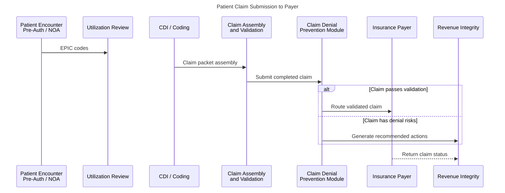
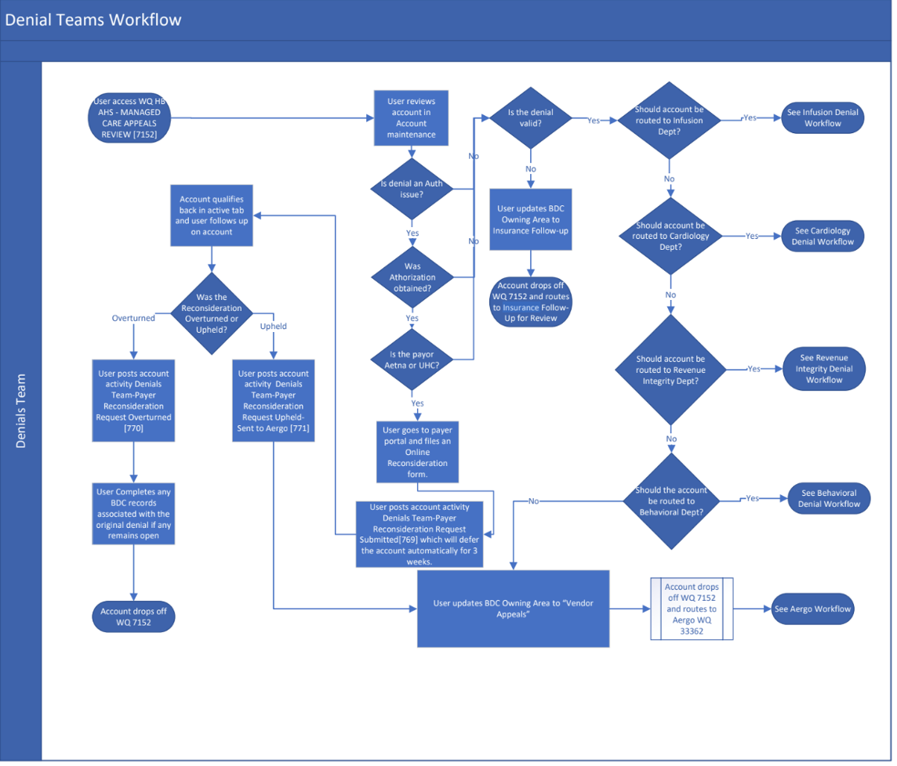

---  
title: Claim Denial Prevention - Proposal  
artifact-type: proposal  
version: 0.3  
status: draft  
owner: Karen Sullivan  
last-reviewed: 2026-06-21  
  
domain: Healthcare Revenue Cycle  
capability: Claim Denial Prevention  
  
audience:  
- Business Analyst  
- Solution Architect  
  
tags:  
- healthcare  
- utilization management  
- revenue cycle
---
# Claim Denial Prevention / Utilization Management Visibility
## High Level Solution Proposal

**City Hospital, Newark, New Jersey**

---

## Proposal Review and Approval

| Version | Date         | Reviewed By             | Comments                               | Approval |
| ------- | ------------ | ----------------------- | -------------------------------------- | -------- |
| 0.1     | June 15, 2026 | Karen Sullivan (author) | fictional high-level proposal document |          |
| 0.2     | June 19, 2026 | Karen Sullivan         | inline sequence diagram,<br>front matter metadata        |          |

---

# 1. Definitions

**1.1 DRG (Diagnosis Related Group)**

A system that classifies hospital inpatients into groups with similar diagnoses to determine hospital reimbursement.

**1.2 CDI (Clinical Documentation Integrity)**

A program focused on improving the accuracy of clinical documentation to ensure reimbursement.

**1.3 Clean Claim**

A claim submitted with complete, accurate, and valid information that can be paid without requiring correction.

**1.4 NOA (Notification of Admission)**

A notification sent to the payer informing them that a patient has been admitted to a hospital.

**1.5 SNS Topic / SNS Notification (Simple Notification Service)**

A communication channel used to send alerts to interested stakeholders.

**1.6 UB-04 (Uniform Billing Form 2004)**

Standard claim form used by hospitals to bill payers.

**1.7 UM Visibility (Utilization Management Visibility)**

A service that monitors patient case status.

**1.8 UR (Utilization Review)**

The process of evaluating medical necessity of healthcare services.

---

# 2. Problem Statement

Insurance claims at City Hospital currently have a denial rate of 15%. Many denials stem from missing authorizations, coding inconsistencies, or incomplete documentation that could be identified before claim submission.

Currently, the claim submission process flow uses EPIC claim validation rules to ensure the claim is not missing required information, for example:

- Missing physician documentation
- Missing diagnostic codes
- Missing procedure codes

Revenue-cycle teams often discover claim issues only after claim submission, when payers reject the claim. Resolving denials requires manual investigation across multiple department IT systems, which delays reimbursement.

---

# 3. Proposed Solution

City Hospital submits roughly 2,000 claims per day, totaling over five million dollars in submitted invoices (UB-04). At a 15% denial rate, approximately $750,000 in claims may require rework, appeal, or resubmission each day, increasing administrative costs and delaying reimbursement.

Reducing claim denials requires connecting data that currently resides in separate clinical, billing, authorization, and claims systems. Foundry provides a common operational platform that integrates these data sources, supports risk evaluation workflows, and enables proactive intervention before claim submission.

Palantir Foundry serves as the data integration and operational intelligence platform for the Claim Denial Prevention Platform. Hospital data and claims workflows are modeled within a Foundry Claims Ontology, creating an intelligent digital representation of the organization's data, processes, and operations. The ontology models business objects, the relationships between those objects, and the actions performed by hospital personnel throughout the claim lifecycle.

The Claim Denial Prevention Platform will provide the following capabilities, organized as Functional Requirements:

**FR-3.1** Aggregate data from multiple hospital systems
	- **FR-3.1.1** Use multiple in-house data sources to enhance UM visibility and quality of claim data.

**FR-3.2** Maintain the Consolidated Claim Record
	- **FR-3.2.1** Subscribe to updates for Consolidated Claim Record data.
	- **FR-3.2.2** Automate Consolidated Claim Record update processes.
	- **FR-3.2.3** Maintain audit records for all data imports and updates.

**FR-3.3** Support risk evaluation workflows
	- **FR-3.3.1** Ensure patient diagnosis codes align with treatment and procedure codes according to payer contracts.
	- **FR-3.3.2** Check payer historical denial rates for similar claims.
	- **FR-3.3.3** Perform denial risk analysis on claim packet data.
	- **FR-3.3.4** Assign a denial risk score.
	- **FR-3.3.5** Route high-risk claims to the appropriate Revenue Integrity team.

**FR-3.4** Provide operational dashboards
	- **FR-3.4.1** Track real-time payer approval and denial determinations.

---

# 4. Revenue Cycle Workflow and Proposed Solution Integration

The Revenue Cycle Workflow will be updated with the Claim Denial Prevention Platform prior to claim submission.

**Figure 1. Revenue Cycle Workflow**

---

# 5. Claim Denial Prevention Platform

The platform consists of four major areas described below.

## 5.1 Claim Data Aggregation

Several in-house data stores will be aggregated into a canonical **Consolidated Claim Record**. Source systems publish notifications when claim-related information changes. The platform responds by retrieving the updated data from the source system, transforming the information into a standardized update record, and placing the update into a processing queue for downstream processing. The resulting updates are used to maintain a current, unified view of clinical, billing, authorization, eligibility, and historical claims data.

The Claim Denial Prevention Platform:

**5.1.1** Subscribes to relevant SNS topics
**5.1.2** Validates incoming events
**5.1.3** Normalizes source data
**5.1.4** Updates the Consolidated Claim Record

The resulting record provides a unified view of clinical, billing, authorization, eligibility, and historical claims data, supporting claim processing. The following example shows a consolidated claim record.

**Table 1. Consolidated Claim Record**

| Section         | Field                  | Source System        | Example Data               |
| --------------- | ---------------------- | -------------------- | -------------------------- |
| Claim           | claimId                | Billing              | C00987                     |
| Claim           | status                 | Billing              | Pending Submission         |
| Patient         | patientId              | EPIC EHR             | P7890-1                    |
| Patient         | name                   | EPIC EHR             | William Shakespeare        |
| Insurance       | payer                  | Eligibility          | Aetna POS II               |
| Insurance       | policy                 | Eligibility          | W567465                    |
| Insurance       | coverageStatus         | Eligibility          | Active                     |
| Authorization   | authorizationRequired  | Authorization System | Yes                        |
| Authorization   | authorizationStatus    | Authorization System | Approved                   |
| Authorization   | authorizationNumber    | Authorization System | AUTH-555512                |
| Coding          | codeDiagnosis          | Coding               | M17.11                     |
| Coding          | codeProcedure          | Coding               | 27447                      |
| Denial History  | priorSimilarDenials    | Claims Analytics     | 3                          |
| Risk Assessment | riskScore              | Risk Engine          | 72                         |
| Risk Assessment | riskFactors            | Risk Engine          | Documentation Insufficient |
| Analytics       | estimatedRevenueAtRisk | Analytics Engine     | $4,800                     |
| Workflow        | recommendedAction      | Workflow Engine      | Coding Review              |
| Workflow        | priority               | Workflow Engine      | 3                          |
| Workflow        | assignedTeam           | Workflow Engine      | Revenue Integrity B19      |

### Example Update Event

The following example illustrates a simplified update record generated after the platform retrieves updated information from a source system. The actual implementation may contain additional fields and metadata.

**Example 1. Eligibility Update Record**

```json
{
  "eventId": "EVT-20260609-001245",
  "eventTimestamp": "2026-06-09T14:23:17Z",
  "sourceSystem": "EligibilityService",
  "action": "UPDATE",
  "claimId": "C00987",
  "patientId": "P7890-1",
  "insurance": {
    "payer": "Horizon BCBS",
    "planType": "PPO",
    "policyNumber": "HZ123456789",
    "groupNumber": "GRP-4492",
    "coverageStatus": "Active",
    "effectiveDate": "2025-01-01",
    "terminationDate": null
  },
  "audit": {
    "updatedBy": "EligibilityService",
    "updateReason": "Coverage verification refresh",
    "correlationId": "REQ-98A7C1"
  }
}
```

**Example 2. Authorization Update Record**

```json
{
  "eventId": "EVT-20260609-001246",
  "eventTimestamp": "2026-06-09T14:25:02Z",
  "sourceSystem": "AuthorizationSystem",
  "action": "UPDATE",
  "claimId": "C00987",
  "patientId": "P7890-1",
  "authorization": {
    "authorizationRequired": true,
    "authorizationStatus": "Approved",
    "authorizationNumber": "AUTH-555512",
    "expirationDate": "2026-07-31"
  },
  "audit": {
    "updatedBy": "AuthorizationSystem",
    "updateReason": "Prior authorization approval received",
    "correlationId": "REQ-98A7C1"
  }
}
```
---

## 5.2 Risk Evaluation Engine

The Risk Evaluation Engine analyzes each Consolidated Claim Record using:

- Claim-level validation
- Historical analysis
- Operational risk indicators

### 5.2.1 Insurance Coverage Status

- Verify active coverage for date of service
- Identify coverage limitations or restrictions

### 5.2.2 Prior Authorization Status

- Confirm required authorizations
- Detect expired or incomplete authorizations

### 5.2.3 Coding Consistency

- Identify diagnosis/procedure mismatches
- Detect denial-prone coding patterns

### 5.2.4 Documentation Completeness

- Verify supporting documentation
- Identify missing clinical records

### 5.2.5 Payer-Specific Requirements

- Validate compliance with payer rules
- Detect historically rejected conditions

### 5.2.6 Historical Denial Patterns

- Analyze denial rates for similar claims
- Identify recurring denial trends

### 5.2.7 Provider and Department Trends

- Evaluate departmental denial rates
- Identify operational risk patterns

### 5.2.8 Claim Value and Financial Impact

- Estimate financial exposure
- Prioritize high-value claims

### 5.2.9 Data Completeness and Quality

- Detect missing or stale data
- Flag claims for manual review

### 5.2.10 Operational Risk Indicators

- Identify high-risk characteristics
- Generate remediation recommendations

### Evaluation Outputs

Each evaluation generates:

- Risk Score
- Contributing Risk Factors
- Estimated Financial Impact
- Recommended Actions

> Risk scores and recommendations are advisory. Final claim decisions remain the responsibility of authorized clinical, coding, and revenue integrity personnel.

---

# 6. Decision Support Workflows

Decision Support Workflows convert risk evaluation results into operational tasks.

Capabilities include:

- Claim prioritization
- Financial impact assessment
- Routing remediation tasks
- Escalation management
- Resolution tracking

**Figure 2. Decision Support Workflow**



---

# 7. Monitoring and Metrics

Monitoring and Metrics provide visibility into:

- Platform performance
- Operational outcomes
- Prediction accuracy

Prediction accuracy is evaluated by comparing:

- Identified risk factors
- Final payer approvals
- Final payer denials
- Successful pre-submission remediation

**Table 2. Platform Monitoring Metrics**

| Metric                               | Description                           |
| ------------------------------------ | ------------------------------------- |
| Claim Data Event Count               | Daily number of claims processed      |
| Claim Data Dead-letter Count         | Failed event messages                 |
| Consolidated Claim Event Count       | Daily updates to consolidated records |
| Consolidated Claim Dead-letter Count | Failed event messages                 |
| Risk Evaluation Latency              | Evaluation processing time            |
| System Availability                  | Percentage of uptime                  |

**Table 3. Business Metrics**

| Metric                                                  | Description                            |
| ------------------------------------------------------- | -------------------------------------- |
| High-Risk Claims Identified                             | Claims exceeding risk threshold        |
| Remediation Task Completion Rate                        | Percentage of assigned tasks completed |
| Predicted High-Risk Claims Resolved Prior to Submission | Corrected before submission            |
| Average Resolution Time                                 | Time required to resolve issues        |
| Claim Denial Rate                                       | Percentage of denied claims            |
| Claim Denial Rate Trend                                 | Changes over time                      |
| Denial Rate by Department / Physician / Payer           | Breakdown by category                  |

---

# 8. Closing Summary

The Claim Denial Prevention Platform provides an operational layer that:

- Aggregates claim-related data from multiple systems
- Evaluates denial risk
- Routes issues to remediation workflows
- Improves collaboration between departments

By combining data integration, risk evaluation, and operational coordination, the platform enables revenue-cycle teams to address claim issues prior to submission and focus efforts on areas with the greatest potential financial impact.

The proposed solution leverages Palantir Foundry's data integration, operational workflow, and analytics capabilities to transform claim denial prevention from a reactive process into a proactive operational practice.
